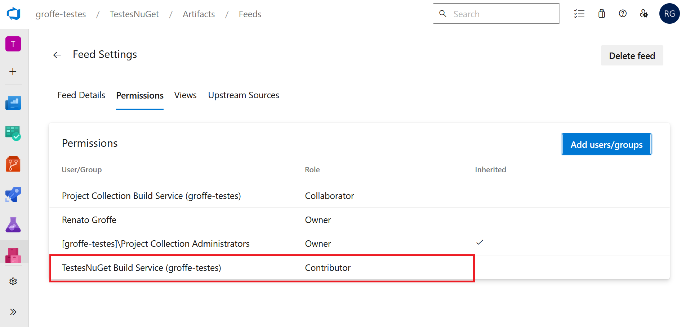

# AzureDevOps-Artifacts-NuGet-DotNet7-GlobalTool
Exemplo de implementação de Global Tool utilizando o .NET 7, com Pipeline do Azure DevOps (+ informações de referência) para publicação do package em um feed privado do Azure DevOps.

---

## Utilizando packages e Global Tools a partir do Azure Artifacts 
Este é um guia simplicado de como trabalhar com packages e Global Tools a partir do Azure Artifacts. Os passos necessários para configuração estão descritos nos itens a seguir.

1. Configurar o **Azure Artifacts Credential Provider** na máquina que utilizará o Azure Artifacts. Os procedimentos para Windows, Linux e Mac podem ser encontrados neste [**link**](https://github.com/microsoft/artifacts-credprovider#azure-artifacts-credential-provider
).

2. Um arquivo nuget.config deverá ser adicionado ao projeto, na mesma pasta em que se encontra o arquivo .csproj ou .sln. Exemplo de como ficará este arquivo:

```xml
<?xml version="1.0" encoding="utf-8"?>
<configuration>
  <packageSources>
    <clear />

    <add key="NOME_FEED" value="https://pkgs.dev.azure.com/NOME_ORGANIZACAO/_packaging/NOME_FEED/nuget/v3/index.json" />

  </packageSources>
</configuration>
```

3. Para **restaurar os packages** utilizar o comando a seguir, em que a opção **--interactive** solicitará o login do usuário caso haja necessidade:

```bash
dotnet restore --interactive
```

4. Para **gerar um novo package localmente** (pacote convencional ou Global Tool) execute a instrução:

``` bash
dotnet pack NOME_PROJETO.csproj -c Release -o out
```

5. Para **publicar o package gerado localmente** execute (em **--source** referenciar o nome do Feed, em **--api-key** uma string qualquer pode ser informada):

```bash
cd out
dotnet nuget push --source "NOME_FEED" --api-key az *.nupkg
```

6. Para possibilitar o **push do package via Pipeline** é necessário atribuir o **role Contributor** ao **Build Service** do projeto, como indicado na imagem a seguir (solução encontrada no [**Stack Overflow**](https://stackoverflow.com/questions/71299324/response-status-code-does-not-indicate-success-403-forbidden-user-azure-pip)). No pipeline, um Pipeline neste repositório demonstrando isso.




7. Para instalar a **Global Tool** utilize a instrução (lembre de referenciar o release correto em **--version**):

```bash
dotnet tool install --global ShowGroffeNameAzDevOps --version 1.0.0 --add-source=https://pkgs.dev.azure.com/NOME_ORGANIZACAO/_packaging/NOME_FEED/nuget/v3/index.json
```

8. Para desinstalar a **Global Tool** executar:

```bash
dotnet tool uninstall --global ShowGroffeNameAzDevOps
```